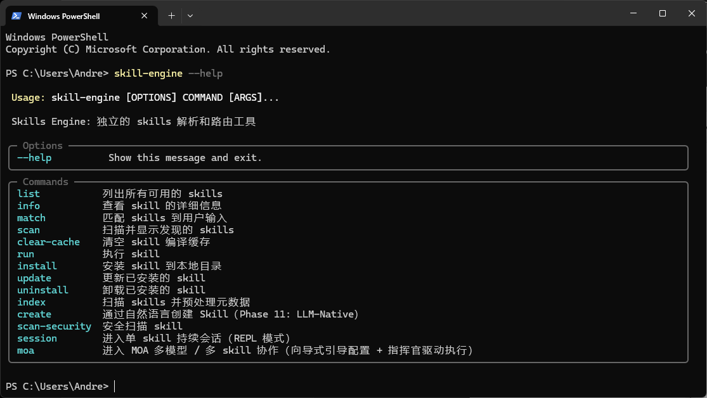
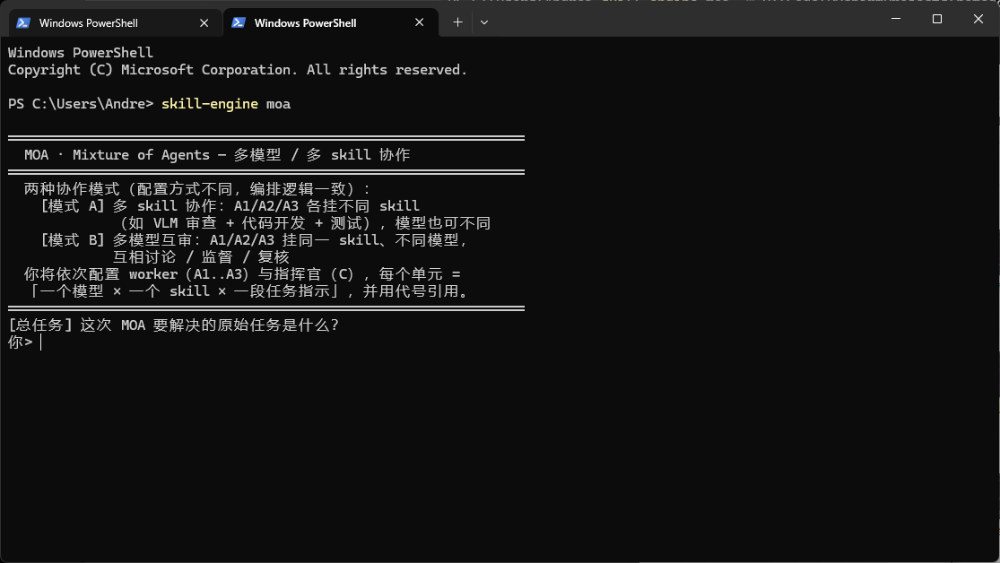
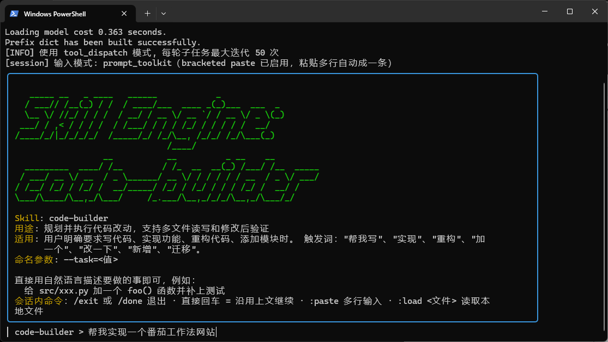
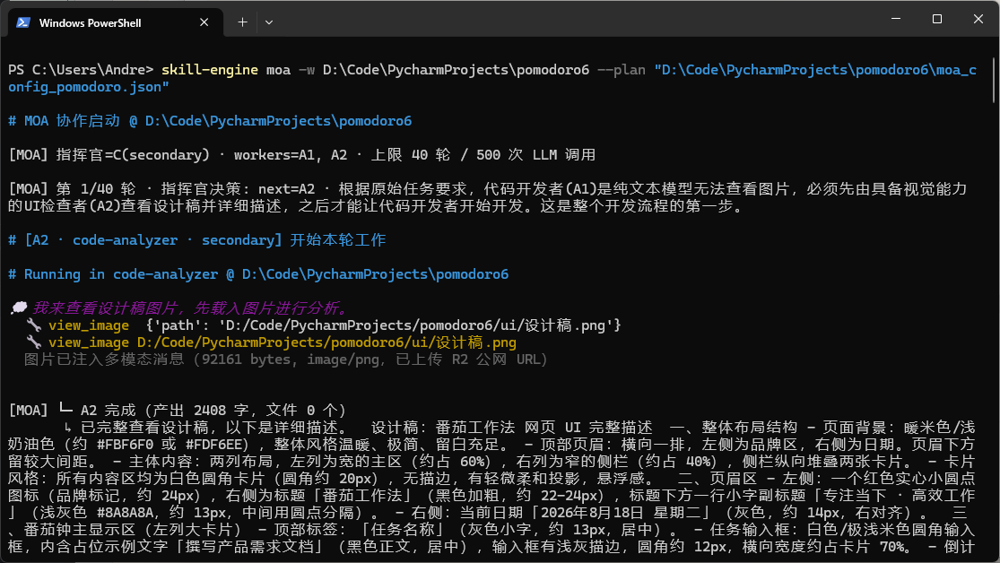
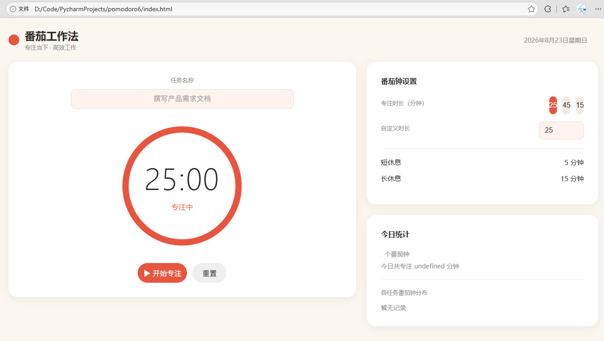
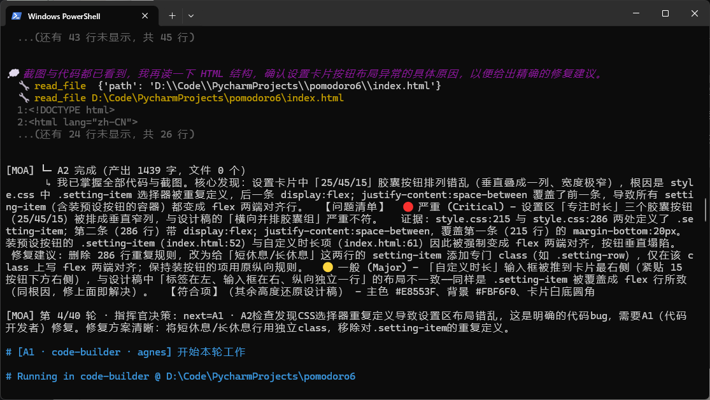
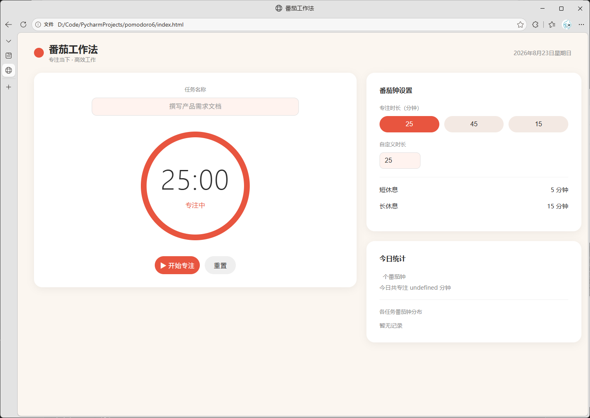

# Skills Engine

围绕 skills 解析、路由、调试、执行的CLI 工具。提供较为完整的Agent harness能力，可以作为个人学习和使用的**Agent Harness**，也可以作为个人开发skill的调试工具。

## 核心特性

skill-engine 是一个用于个人开发和日常工作的**Agent harness**，并围绕三种核心运行模式构建：

- **Skill 检索与执行引擎** —— 不依赖任何 AI 产品，自带三级路由（精确名称 / 关键词打分 / LLM 兜底）与四路执行分流（Steps DSL 确定性执行 / tool_dispatch LLM 循环 / 单次 LLM 调用/ 纯编译（dry-run）），可以高效调试和运行个人开发的小型skill。
- **Session 模式（长任务）** —— 小型Agent harness，基于 code-harness 的持久 REPL 会话，支持状态持久化与断点恢复，适合多轮调试、代码优化、联网查询等需要持续交互的长任务。
- **MOA 模式（多模型协作）** —— 主要用于解决当前编码能力强的模型不具备图片识别导致无法根据UI设计稿开发前端的痛点，可以由指挥官统筹，VLM 负责视觉/截图审查、LLM 负责编码，协同攻克复杂逻辑或「VLM + LLM 协作」类任务。

> 档位 A（单次 LLM 调用）与档位 B（tool_dispatch 工具循环）是上述三种模式的底层执行档位，按需自动选择，无需单独记忆。

## 功能展示

> 以下截图来自真实运行环境，展示 skill-engine 的核心能力与界面。图片随仓库 `demo/` 目录一起发布。

### 整体介绍与项目结构
引擎CLI整体介绍 



### 两种核心运行模式

| MOA 多模型协作 | Session 多轮代码会话（code-harness） |
| --- | --- |
|  |  |

- **MOA 模式（多模型协作）**：多Agent，多Skill模式，用于处理对于交付质量要求高或者不同模态分工合作的场景。也可以用于需要多个skill共同完成一项任务的场景。（详见下方「实战案例 · 设计稿驱动 UI 开发」）。
- **Session 模式（多轮会话）**：基于 code-harness 的持久 REPL 会话，支持状态持久化与断点恢复，适合多轮调试、代码优化与联网查询。

## 实战案例（Demo）

以下案例均包含**完整运行记录**（含工具调用、思考过程、最终结果），可点击链接直达 `demo/` 目录查看原始日志与全部截图。

### 案例一：MOA + VLM 指导 LLM 根据设计稿完成 UI 开发

多模型协作实战：指挥官拆解任务，VLM 对生成的 UI 截图做视觉审查并给出审判意见，LLM 据此修复，多轮迭代直至交付。

| 开始执行 | 初版 UI | VLM 截图审查 | 最终交付 |
| --- | --- | --- | --- |
|  |  |  |  |

- 📂 [查看完整 demo 文件夹](demo/moa-VLM指导LLM根据设计稿完成ui开发/)
- 📄 [完整运行记录（txt）](demo/moa-VLM指导LLM根据设计稿完成ui开发/完整运行记录.json)

### 案例二：Session 模式解决「AC 率始终为 0」问题

多轮 code-harness 会话：Agent 在 code-tutor-agent 项目中排查画像 AC 率显示异常，逐轮读取源码、查询数据库、定位根因（`get_user_profile_v2()` 缺少 AC 率计算），最终修复并验证 42.86%（36/84）。

| 开始执行 | 发现问题 | 最终执行结果 |
| --- | --- | --- |
|  |  |  |

- 📂 [查看完整 demo 文件夹](demo/session%20解决AC为零的问题。-第四轮优化/)
- 📄 [执行记录（txt）](demo/session%20解决AC为零的问题/执行记录.txt)

## 安装

本项目用 [uv](https://docs.astral.sh/uv/) 管理依赖（也兼容 pip）。`skill-engine` 是一个带命令行入口（`skill-engine`）的可安装包，要求 **Python >= 3.12**。

### 方式一：用 uv 安装（推荐，开发者）

```bash
# 1. 安装 uv（若未装）
curl -LsSf https://astral.sh/uv/install.sh | sh        # macOS / Linux
# Windows (PowerShell): irm https://astral.sh/uv/install.ps1 | iex

# 2. 克隆并安装（含所有可选依赖）
git clone https://github.com/YanzheShi/skill-engine.git
cd skill-engine
uv sync --all-extras          # 等价于旧文档里的 ui / tokenize 等
```

### 方式二：用 pip 安装（通用）

```bash
pip install -e .              # 可编辑安装（开发用，改代码即时生效）
# 或装成普通包
pip install .
```

### 方式三：一行装成自包含 CLI（uv tool，推荐给使用者）

把 `skill-engine` 命令直接装进**隔离环境**并加入 PATH，装一次到处能用，**命令脚本本身不再依赖本仓库目录**：

```bash
# 从本地仓库安装（开发机 / 本机）
uv tool install . --upgrade
# 或从 GitHub 安装（他人机器，无需克隆）
uv tool install git+https://github.com/YanzheShi/skill-engine.git
# 升级
uv tool upgrade skill-engine
```

> ⚠️ **冲突警告（重要）**：如果你之前在本仓库跑过 `pip install -e .`（可编辑安装），Python 会在 `site-packages` 留一个 `.pth` 软链直接指向本仓库源码（如 `_editable_impl_skill_engine.pth`）。这会导致 `skill-engine` 命令**仍绑定仓库目录**——删掉仓库命令就废。装 uv tool 版前务必先卸掉可编辑安装：
> ```bash
> pip uninstall -e .
> # 若卸载被拦截（如沙箱 safe-delete），手动删：
> #   site-packages/_editable_impl_skill_engine.pth
> #   site-packages/skill_engine-0.1.0.dist-info/
> #   Scripts/skill-engine.exe  (Windows)
> ```
> 装完后用 `where skill-engine`（Windows）/ `which skill-engine`（macOS/Linux）确认解析到的是 uv tool 路径（如 `~/.local/bin/skill-engine` 或 `%LOCALAPPDATA%\uv\bin\skill-engine`），而不是 Python 的 `Scripts\skill-engine`。

> 区别：`uv sync` 是**开发态**命令（建 `.venv`、锁依赖、便于改代码）；`uv tool install` / `pip install` 是把包装进隔离或当前环境，更适合"只用命令行"的人。

## 部署后：脱离仓库目录运行（使用者必读）

`skill-engine` 用方式三装成全局工具后，**命令脚本本身已脱离仓库目录**，可在任意目录直接执行（无需 `cd` 进仓库）。但运行时仍有两处"位置依赖"需要理解，否则会误以为命令坏了：

### 1. Skills 从哪来

CLI 默认只扫描 `当前工作目录下的 skills/` 子目录。因此：

- **用法 A（项目内）**：`cd` 进一个有 `skills/` 子目录的项目，再执行 `skill-engine list` / `run`；
- **用法 B（全局常驻，推荐）**：把 skills 放到用户级目录 `~/.skill-engine/skills/`（Windows：`C:\Users\<你>\.skill-engine\skills\`），任意目录都能 `list` 到，无需 `cd`；
- **用法 C（临时指定）**：用 `--root` / `-w` 显式指定根目录，例如 `skill-engine scan --root D:/你的项目`、`skill-engine run "生成题解" -w D:/目标目录`。

> 引擎还会扫描 `~/.agents/skills/`、`~/.claude/skills/`（Claude Code 生态兼容），通过相应开关开启 `extend_skills`。

### 2. LLM / MCP 配置从哪来（config.yml 统一配置源）

项目已迁移到单一配置源 **`config.yml`**（取代原先分散的 `.env` 与 `models.yaml`）。`config.py` 在 import 时读取它并回填环境变量，因此「位置」成为关键。全局命令（uv tool 安装）下，`config.yml` 按以下优先级自动定位，**无需你手动设路径**：

1. **环境变量 `SKILL_ENGINE_CONFIG_YAML`**（兼容旧名 `SKILL_ENGINE_MODELS_YAML`）显式指定——最高优先，可强制指向任意位置；
2. **当前工作目录向上查找**——你在 skill-engine 项目目录（或其子目录）跑命令时，自动命中项目根的 `config.yml`；
3. **用户级全局 `~/.skill-engine/config.yml`**（Windows：`C:\Users\<你>\.skill-engine\config.yml`）——脱离仓库、任意目录跑都能读到，最契合「全局 CLI」；
4. **兜底**：基于包安装位置的回溯（开发 / 源码模式，安装版通常不存在）。

> 优先级即：显式指定 > CWD 向上 > 用户级全局 > 兜底。任选其一布置你的 `config.yml` 即可。
> `config.yml` 里的 `mcp_config`（如 `./mcp.json`）若是相对路径，会**基于 config.yml 所在目录**解析——所以全局常驻时把 `mcp.json` 和 `config.yml` 放同一目录即可。

**兜底兼容**：真实环境变量（含 CI 注入）始终优先于 `config.yml`；旧名无前缀的 `LLM_MODEL/LLM_BASE_URL/LLM_API_KEY` 仍有过渡回退。因此「系统环境变量」依然是最稳的零文件方案（设置 → 系统 → 关于 → 高级系统设置 → 环境变量 → 用户变量）：

```
SKILL_ENGINE_LLM_MODEL=gpt-4o
SKILL_ENGINE_LLM_BASE_URL=https://api.openai.com/v1
SKILL_ENGINE_LLM_API_KEY=sk-xxx
```

## 配置：config.yml（统一配置源）

项目用单一 `config.yml` 管理 LLM 与全局设置，**密钥用 `${ENV}` 引用、不写明文**，因此 `config.yml` 本体可入库（模板见 [config.yml.example](config.yml.example)）。

从模板复制出你自己的配置（密钥不入库，需自行创建）：

```bash
cp config.yml.example config.yml              # 项目内布置（在目录里跑自动命中）
# 或全局常驻（任意目录都能读到）：
mkdir -p ~/.skill-engine && cp config.yml.example ~/.skill-engine/config.yml
```

最小配置（`config.yml`）——一个 OpenAI 兼容模型 + 全局设置：

```yaml
models:
  - name: default
    model: gpt-4o
    base_url: https://api.openai.com/v1
    api_key: ${OPENAI_API_KEY}
    provider: openai
  - name: deepseek
    model: deepseek-chat
    base_url: https://api.deepseek.com
    api_key: ${DEEPSEEK_API_KEY}
    provider: openai

settings:
  security_mode: permissive
  auto_approve: all
  mcp_config: ./mcp.json
  tavily_api_key: ${TAVILY_API_KEY}
```

支持任何 OpenAI 兼容的 API 提供商，包括：

- OpenAI（GPT 系列）
- DeepSeek
- 通义千问（DashScope）
- vLLM 本地部署
- Ollama 本地模型
- 其他任何兼容 OpenAI 接口的服务

> 完整配置项与多模型 profile（MOA 协作）见 [config.yml.example](config.yml.example)。

## 快速开始

```bash
# 列出 skills
skill-engine list

# 匹配 skills
skill-engine match "生成题解"

# 执行 skill（默认：路由自动选择最合适的执行档位）
skill-engine run "生成题解"

# Session 模式：长任务 / 多轮调试 / 代码优化（可持续交互、断点恢复）
skill-engine session "帮我重构这段代码" --skill leetcode-solution-writer --max-iter 20

# MOA 模式：复杂逻辑 / VLM+LLM 协作（如按设计稿开发 UI）
skill-engine moa "根据 designs/home.png 实现首页 UI"

# 启动 Web UI
skill-engine web
```

> Session / MOA 的实战运行截图见上方「功能展示」与「实战案例」章节。

## 目录结构

```
src/skill_engine/
├── cli.py                # CLI 入口（typer）
├── ui.py                 # Gradio Web UI
├── config.py             # LLM 配置 + 安全配置 + MCP 配置
├── models/
│   └── models.py         # Skill / SkillMeta / MatchPlan / Step / RunResult 等
├── routing/
│   ├── router.py         # 三步路由（精确→关键词→LLM）
│   ├── registry.py       # Skill 注册表 + meta 缓存
│   ├── discovery.py      # 多根目录 skill 扫描
│   ├── scoring.py        # 关键词评分（intention/synonym/verb/noun）
│   ├── tokenize.py       # jieba 分词 + 专名提取
│   └── domain_words.py   # jieba 领域词自动注册
├── execution/
│   ├── runner.py         # 核心执行器（四路分流 + 审批）
│   ├── executor.py       # 命令执行（subprocess 沙箱）
│   ├── assembler.py      # Prompt 编译 + !cmd 预处理
│   ├── steps.py          # Steps DSL 执行器
│   ├── orchestrator.py   # 多 skill 编排
│   ├── moa.py            # MOA 多模型协作（指挥官 + worker 调度 + 防死循环闸）
│   ├── tool_dispatch.py  # 档位 B LLM 工具循环（handler 分发表 + IO 并行调度）
│   ├── tool_defs.py      # 内建工具 schema 定义（@tool 桩）
│   ├── tool_exec/        # 档位 B 工具执行引擎（每工具一个 handler）
│   │   ├── handler.py    # ToolHandler 协议 + BatchableHandler 三段式基类
│   │   ├── result.py     # ToolResult（统一五步仪式的数据载体）
│   │   ├── context.py    # ToolContext（handler 共享态，替代闭包捕获）
│   │   ├── registry.py   # 内建工具分发表（switch-on-type → {name: handler}）
│   │   ├── io_sched.py   # read/search 并行批调度器（保序回灌）
│   │   ├── parse.py      # LLM 响应 tool_calls 归一化
│   │   ├── verify.py     # verify_command 自动验证钩子
│   │   ├── bash_util.py  # bash 路径提取 + 观测格式化
│   │   ├── edit_patch.py # edit 模糊匹配 + unified diff
│   │   ├── search.py     # ripgrep + python 兜底搜索
│   │   └── handlers/     # 每工具一个 handler（bash/read_file/write_file/...）
│   ├── context_manager.py # token 预算 + 历史压缩
│   ├── file_tracker.py   # 已读版本追踪 + 缓存（edit 一致性校验）
│   ├── image_hosting.py  # view_image 图片公网上传（R2）
│   ├── tracer.py         # 调试轨迹记录器
│   ├── counting_llm.py   # LLM 调用/token 计数代理（MOA 预算闸）
│   ├── mcp_client.py     # MCP 服务器连接客户端
│   ├── snapshot.py       # 文件检查点 / 回滚系统
│   ├── human_io.py       # 人机交互抽象层（CLI / prompt_toolkit）
│   ├── paste_buffer.py   # 大段内容外置化保存
│   └── paths.py          # 跨平台路径归一化
├── security/
│   └── scanner.py        # 离线扫描 + 运行时审批
└── creator/
    ├── creator.py        # Skill 创建
    ├── designer.py       # Skill 设计（LLM prompt）
    ├── preprocessor.py       # Meta 抽取（LLM 驱动）→ 内容寻址落用户级 ~/.skill-engine/cache/meta
    └── builtins.py       # 内置脚本模板
```

## 路由匹配（三步管线）

```
用户输入 "帮我清理临时文件"
        │
        ▼
 ① 精确匹配 (name/alias/shortcut)
    │
    ▼
 ② 关键词打分 (jieba + intention 权重)
    │  verb 命中: (交集/总数) × 0.5
    │  noun 命中: (交集/总数) × 0.25
    │  phrase bonus: 多字短语 +0.08~0.48
    │  link bonus: 动名双中 +0.15~0.25
    │  0.5 gap 裁断
    ▼
 ③ LLM 兜底 (0 命中/多候选/低分时触发)
    │
    ▼
 返回 MatchPlan (single/multi)
```

## 执行流程

skill-engine 提供三种运行模式，对应不同复杂度的任务：

```
用户请求
   │
   ├─ run    → 单轮执行（四路分流，见下）
   │
   ├─ session → 长任务多轮 REPL 会话（持续交互、断点恢复）
   │
   └─ moa    → 多模型协作（指挥官 + VLM 视觉审查 + LLM 编码）
```

### run() 四路分流（单轮执行）

```text
runner.run()
   │
   ├─ ① 自动解析 Steps（body 中有 ## Steps？）
   │
   ├─ ② tool_dispatch 循环（LLM 驱动 bash/read/write 工具）
   │
   ├─ ③ 单次 LLM 调用（档位 A）
   │
   └─ ④ 纯编译（返回 final prompt，pipe 给外部）
```

### 档位 B（tool_dispatch）工作流

```text
tool_dispatch.run()
   │
   ├─ 编译 final prompt（Assembler）+ 绑定工具（bind_tools）
   ├─ 初始化上下文管理器 / 文件快照 / 已读追踪 / IO 调度器
   ├─ 循环（每轮一次 LLM 调用）：
   │   ├─ LLM 返回 tool_calls → 解析归一化
   │   ├─ 可并行工具（read/search）入 IO 批，串行工具先 flush 批
   │   ├─ 分发表执行：handlers[tc.type].execute(tc, ctx) → ToolResult
   │   ├─ _apply_result 统一落 messages / step_results / files_created
   │   ├─ 写盘后触发 verify_command 钩子（失败回灌结构化信号）
   │   └─ 轮末压缩上下文
   ├─ 无 tool_calls → 返回最终答案 / 达到 max_iterations 退出
   └─ 落盘状态（支持 --resume-from 续跑）

加第 N 个工具 = 在 tool_exec/handlers/ 新建 handler + registry 注册一行，
不再动 run() 循环。
```

### Session 模式流程（长任务多轮会话）

```text
session.start()
   │
   ├─ 载入/恢复状态（--state-path / --resume-from 断点恢复）
   ├─ 循环（直到用户 /exit 或达到 --max-iter）：
   │   ├─ 读取用户输入（prompt_toolkit，支持多行粘贴）
   │   ├─ 路由匹配目标 skill（复用 run() 四路分流）
   │   ├─ 执行并回写上下文（文件改动 / 工具结果累积进会话）
   │   └─ 持久化本轮状态
   └─ 输出最终结论
```

### MOA 模式流程（多模型协作）

```text
moa.start()
   │
   ├─ 指挥官（Commander）拆解任务、制定子计划
   ├─ 循环（直到交付）：
   │   ├─ LLM 编码实现（产出代码 / 文件）
   │   ├─ VLM 对运行截图 / 产物做视觉审查、给出审判意见
   │   ├─ 指挥官汇总意见，指挥 LLM 修复
   │   └─ 收敛判定（达标则交付，否则进入下一轮）
   └─ 输出最终交付物
```

> 两种模式的真实运行截图与完整记录见上方「实战案例」章节。

### 内建工具（tool_dispatch 模式可用）

| 工具 | 功能 |
|------|------|
| `bash` | 执行 shell 命令（超时钳制 + 文件登记选择性失效） |
| `read_file` | 读取文件内容（分页 / 缓存命中 / 重复读检测） |
| `write_file` | 写入文件（安全门 + diff 预览 + 快照） |
| `edit_file` | 定点编辑（精确优先 + 模糊匹配 + diff 预览） |
| `search_files` | 搜索文件内容（ripgrep，并行批） |
| `view_image` | 查看图片（多模态注入 / R2 公网上传） |
| `web_search` | 网络搜索（需配置 Tavily） |
| `run_python` | 运行 Python 脚本 |
| `query_db` | 查询数据库 |
| `shot_web` | 网页截图 |
| `update_plan` | 更新任务计划 |
| `restore_file` | 回滚文件到检查点（通用文件回滚，不依赖 git） |
| `get_current_time` | 获取当前时间 |
| `stop` | 停止执行 |
| `ask_user` | 轮内向用户提问（session 模式专属） |

read_file / search_files 是可并行批工具（纯磁盘读，IO 调度器统一调度），
其余为串行工具。可通过 `extra_tools` 和 `mcp_servers` 扩展工具集；
新增内建工具只需在 `tool_exec/handlers/` 加一个 handler 并在 `registry.py` 注册。

## 元数据预处理

`skill-engine index` 命令会对所有 skill 进行 LLM 驱动的元数据抽取：

```bash
# 增量预处理（仅处理新 skill / SKILL.md 已变更的 skill）
skill-engine index

# 首次全量构建
skill-engine index --build-meta

# 强制全量重抽（如抽取 prompt 大改后）
skill-engine index --rebuild-meta
```

抽取的元数据字段：`intention`、`synonyms`、`purpose`、`keywords`，这些信息会参与路由匹配的第二阶段关键词打分。

### Meta 缓存落点与生命周期

抽取结果（LLM 派生）**不写入 skill 源树**，而是按内容寻址落到用户级缓存目录：

```
~/.skill-engine/cache/meta/<source_hash>__v<ver>.yaml
```

设计要点：

- **内容寻址 + 跨项目共享**：文件名由 SKILL.md 正文 hash 与抽取器版本（`EXTRACTOR_VERSION`）决定。同一份 SKILL.md 内容在全机任何项目只抽一次，换项目 / 换目录不重复抽。
- **可删可重建**：这是派生缓存，不是 skill 资产。`rm -rf ~/.skill-engine/cache` 安全，引擎下次匹配时自动按内容寻址重建；`--rebuild-meta` 会按抽取器版本让旧缓存失效重抽。
- **`.skill-local.yaml` 是另一类**：用户覆写（authoritative，应保留），与 meta 缓存（rebuildable）性质不同，不要混淆。
- `.gitignore` 已忽略 `.skill-meta.yaml` 与 `.skill-engine/cache/`，作为双保险。

## MCP 服务器集成

通过 `mcp.json` 配置文件连接外部 MCP 服务器：

```json
{
  "mcp_servers": {
    "my-server": {
      "command": "node",
      "args": ["server.js"],
      "env": {"KEY": "value"}
    }
  }
}
```

支持 stdio、HTTP、SSE 三种传输方式。

## MOA 多模型协作模式

针对「复杂逻辑」或「VLM + LLM 协作」类任务：由指挥官（Commander）拆解任务并统筹，VLM 负责视觉/截图审查，LLM 负责编码实现，多模型协同迭代直至交付。

典型场景：根据设计稿完成 UI 开发——VLM 对生成截图做视觉审查并给出审判意见，LLM 据此修复，多轮收敛（见上方「实战案例 · 案例一」）。

多模型 profile 配置见 [config.yml.example](config.yml.example)（MOA 协作）。

## 多轮 REPL 会话

对同一 skill 发起持续交互式会话：

```bash
skill-engine session "帮我写代码" --skill leetcode-solution-writer --max-iter 10
```

支持状态持久化（`--state-path`）和断点恢复（`--resume-from`）。

## 安全审批

### 两层架构

- **离线扫描**：正则 + LLM 分析 skill 安全性，只提醒不阻止
- **运行时审批**：`should_approve()` → `_check_approval()` 弹窗交互

### 安全模式

| 模式 | 环境变量 | tool_dispatch | step_exec |
|------|---------|---------------|-----------|
| strict | 不设（默认） | BLOCK（直接拦截） | 危险命令弹窗 |
| permissive | `SKILLS_ENGINE_SECURITY_MODE=permissive` | 命令级检查（安全命令放行） | 危险命令弹窗 |
| off | `SKILLS_ENGINE_SECURITY_MODE=off` | SAFE（全放行） | SAFE（全放行） |

### 审批交互（CLI）

```
⚠️  [cleanup-temp] 请求执行:
   命令: rm -rf temp/cache
   本次允许(y) / 会话允许(Y) / 拒绝(N) / 会话拒绝(r) / 全部允许(A):
```

- `y` — 本次允许
- `Y` — 同命令会话允许（记入 `_session_approvals`）
- `N` — 拒绝本次
- `r` — 同命令会话拒绝
- `A` — 当前会话剩余全部允许

### 自动审批

通过环境变量 `SKILLS_ENGINE_AUTO_APPROVE` 配置：

```ini
# 全部放行
SKILLS_ENGINE_AUTO_APPROVE=all

# 指定 skill 的指定命令放行
SKILLS_ENGINE_AUTO_APPROVE=cleanup-temp:rm
```

### 危险命令名单

```python
RISKY_BINARIES = {"rm", "cp", "mv", "chmod", "chown", "dd", "mkfs", "python"}
```

## CLI 命令

```bash
# 路由匹配（--explain 查看打分细节）
skill-engine match "查询" [--explain]

# 执行（路由自动选择档位；--steps 强制 Steps DSL，--tool-dispatch 强制档位 B）
skill-engine run "查询" [--steps] [--tool-dispatch]
                       [--dry-run] [--args "参数"]
                       [--max-iter <N>] [--non-interactive]
                       [--working-root <DIR>]

# Session 模式：长任务多轮会话（--state-path 持久化，--resume-from 断点恢复）
skill-engine session "查询" [--skill <NAME>] [--max-iter <N>]
                            [--working-root <DIR>] [--state-path <PATH>]
                            [--resume-from <PATH>]

# MOA 模式：多模型协作（指挥官 + VLM 视觉审查 + LLM 编码）
skill-engine moa "任务描述" [--skill <NAME>] [--max-iter <N>]
                      [--working-root <DIR>] [--state-path <PATH>]

# 扫描
skill-engine scan [--root DIR]

# 索引（元数据预处理）
skill-engine index [--build-meta] [--rebuild-meta]

# 创建 skill（LLM 驱动）
skill-engine create "生成 vue 组件" [--name <NAME>] [--dry-run]

# 管理
skill-engine list [-v]
skill-engine info <name>
skill-engine install <url|path>
skill-engine update <name>
skill-engine uninstall <name>

# 安全
skill-engine scan-security [name] [--deep] [--json]

## 缓存

派生缓存统一位于用户级 `~/.skill-engine/cache/`（含 `meta/` 目录的 LLM 抽取结果，按内容寻址）。这是可重建产物，删了不影响功能，引擎按需自动重建。

```bash
# 清空全部派生缓存（meta 等）
skill-engine clear-cache
# 或手动：
rm -rf ~/.skill-engine/cache
```

## SKILL.md 格式

```yaml
---
name: skill-name
description: 技能描述
when_to_use: 触发条件
groups: [category]
argument_hint: 参数提示
allowed_tools: [bash, read_file, write_file]
mcp_servers: [my-server]
human_in_loop: true
---

## User Request

$ARGUMENTS

## Steps

- name: step_name
  type: exec
  command: python scripts/xxx.py $0
  timeout: 30

- name: step_name
  type: llm
  template: LLM 模板，支持 {step_name} 和 $ARGUMENTS

- name: step_name
  type: write
  output_file: output/result.md
  template: 写入内容
```

支持更多元数据字段：`alias`、`shortcuts`、`intent_verbs`、`agent`、`model`、`effort`、`context`（INLINE/FORK）、`turn_policy`、`context_budget`、`disabled_model_invocation`、`user_invocable`、`disallowed_tools` 等。

## Web UI

启动：`skill-engine web`（默认端口 7860）

四个执行面板：

| 面板 | 功能 |
|------|------|
| Skill 列表 | 展示所有可用 skills（含分组） |
| Skill 匹配 | 输入查询展示匹配结果 |
| 直接执行 | 自动匹配 skill 并执行（支持逐步审批） |
| 手动执行 | 选择 skill + 参数（支持逐步交互审批） |

审批流：点击「扫描审批」→ 逐条显示待批命令 → y/Y/N/r 按钮 → 全部完成 →「执行」
暂不支持session和MOA模式

## 测试

```bash
# 运行指定模块测试（推荐，避免 Windows tempfile 问题）
uv run pytest tests/test_phase3.py tests/test_phase4.py tests/test_phase8.py -v

# 全量测试
uv run pytest tests/ -q
```

### 已知问题

- Windows 上 `OSError: [Errno 9] Bad file descriptor` — pytest tempfile 清理问题，不影响功能
- `test_integration.py` 部分测试仍传旧 `method=` 参数

## 环境变量

完整的环境变量列表见 [.env.example](.env.example)。核心配置项：

```ini
# LLM 配置（至少配一个）
SKILL_ENGINE_LLM_MODEL=gpt-4o
SKILL_ENGINE_LLM_BASE_URL=https://api.openai.com/v1
SKILL_ENGINE_LLM_API_KEY=sk-xxx

# 安全模式（可选）
# SKILLS_ENGINE_SECURITY_MODE=permissive
# SKILLS_ENGINE_SECURITY_MODE=off

# 自动审批（可选，跳过弹窗）
# SKILLS_ENGINE_AUTO_APPROVE=all

# MCP 配置（可选）
# SKILL_ENGINE_MCP_CONFIG=./mcp.json

# 搜索 API（可选）
# TAVILY_API_KEY=tvly-xxx
```

## 在其他环境中使用

### 作为库集成到你的 Python 项目

```python
from skill_engine import Router, Runner
from skill_engine.cli import app
```

### 容器化（Docker）

适合 CI、服务器，或"不想配 Python 环境"的场景。最小 `Dockerfile`：

```dockerfile
FROM python:3.12-slim
WORKDIR /app
RUN pip install --no-cache-dir uv
COPY . .
RUN uv sync --all-extras
ENTRYPOINT ["uv", "run", "skill-engine"]
```

构建运行：

```bash
docker build -t skill-engine .
docker run --rm -v "$PWD/skills:/app/skills" -e SKILL_ENGINE_LLM_API_KEY=sk-xxx skill-engine list
```

### 打包成单文件可执行程序（PyInstaller）

适合分发给"完全不想装 Python"的人。在仓库根目录执行：

```bash
uv pip install pyinstaller
pyinstaller --name skill-engine --onefile \
  --hidden-import skill_engine.cli \
  --collect-submodules skill_engine \
  src/skill_engine/cli.py
```

产物在 `dist/skill-engine[.exe]`，可直接拷贝到其他同系统机器运行（无需 Python）。

> 注意：`gradio`（Web UI）和 `jieba`（分词）在单文件打包时需额外 `--collect-data`；若只发 CLI，可省去 `--extra ui` 以减小体积。

## 开源发布清单

- [ ] `LICENSE` 已添加（MIT）
- [ ] `README.md` 含安装、快速开始、配置说明
- [ ] `.env.example` 已提交，真实 `.env` 已被 gitignore 忽略（本项目已满足）
- [ ] `.gitignore` 覆盖 venv / 构建产物 / 运行时产物 / 密钥（本项目已满足）
- [ ] `pyproject.toml` 的 `dependencies` 无私有 / 内部依赖
- [ ] 代码无硬编码密钥、内网地址
- [ ] 测试可跑：`uv run pytest tests/ -q`
- [ ] GitHub 仓库设为 **Public**，并填好 About / Topics
- [ ] 打 release tag 并写 GitHub Release Note（如 `git tag v0.1.0 && git push --tags`）
- [ ] （可选）`CONTRIBUTING.md`、`CHANGELOG.md`、CI（GitHub Actions）

## License

MIT